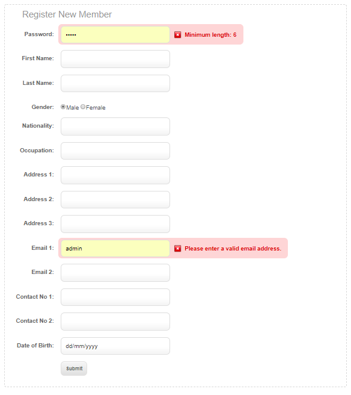
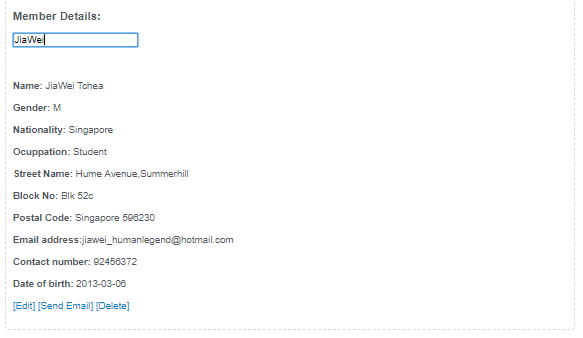
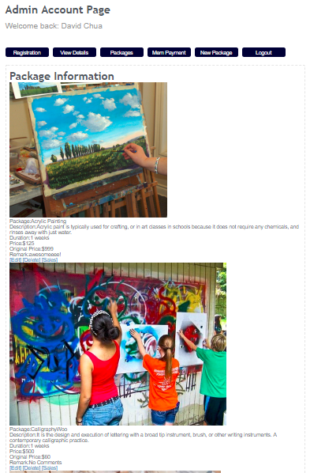
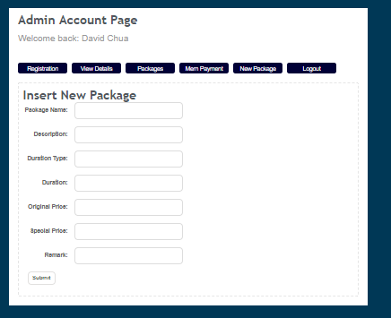
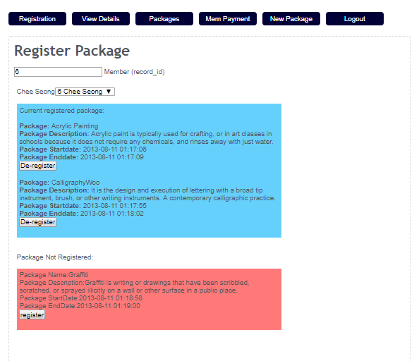
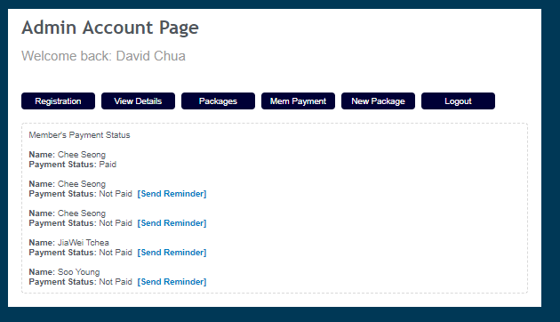
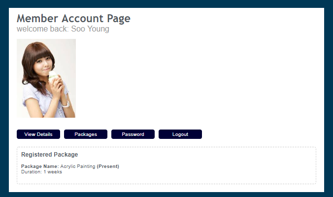
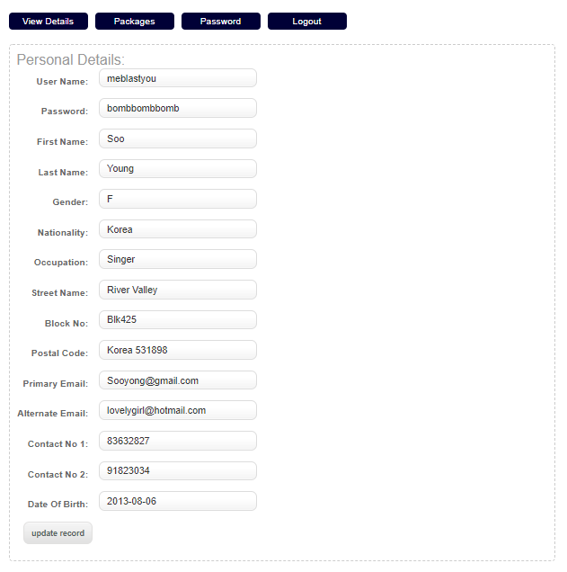

# Summary
Myartspace is an admistrative website that was developed to imitate real world web application to help admins to create new art classes as well as registering members to their interested classes. This was an assignment project for our module 'Web Application Development' where our focus was to learn to develop back-end web application using server side scripting language, PHP and SQL to perform CRUD operations on our database. This project was completed during my sophomore years in polytechnic by me and another team member.

# Main Features
Below is a list of features that forms the main component of the application.

**Administrator**
1. Register a new member account for myartspace
2. View members who are handled by specified admin
3. Create/Edit/Delete art packages
4. Register and deregister members for artclasses
5. Send artclass payment reminder to members
6. Calculate monthly sales of artclasses

**Member**
1. View/Edit personal detail
2. View registered package
3. Reset password

## Screenshots

### Administrator

#### Register a new member account for myartspace

#### View members who are handled by specified admin

#### Create/Edit/Delete art packages

#### Register and deregister members for artclasses

#### Send artclass payment reminder to members

### Member

#### View/Edit personal detail

#### View registered package

#### Reset password

